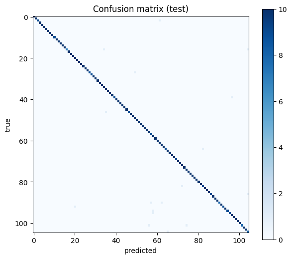
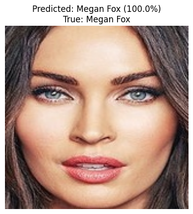

# Face Recognition with MTCNN + FaceNet

A face recognition project that identifies 105 celebrities from a photo. I built it as my final project to learn how modern face recognition pipelines work: detect a face, turn it into an embedding, and classify it.

> **Educational project.** It only uses public celebrity images. Face data is biometric data, so please don't use this code to identify private people without their consent.

## How it works

```
Photo → MTCNN (find the face) → crop 160×160 → FaceNet (512-d embedding, L2-normalized)
      → Keras classifier (who is it?) → "unknown" check → name
```

1. **Face detection (MTCNN):** finds faces in each image and keeps the largest one. Images where no face is found are skipped and counted.
2. **Embeddings (FaceNet via `keras-facenet`):** each face becomes a 512-number vector. Faces of the same person end up close to each other. The vectors are L2-normalized.
3. **Classifier (Keras):** a small neural network (`Dense(128, relu)` → `Dropout(0.3)` → `Dense(105, softmax)`) trained on the embeddings. It uses a separate validation set and early stopping (patience 8) to reduce overfitting.
4. **"Unknown" check:** the model only knows 105 people, so it would always name one of them, even for a stranger. To handle this, a photo is accepted only if:
   - the predicted probability is at least `UNKNOWN_THRESHOLD` (0.60), **and**
   - the cosine similarity to that person's average face (centroid) is at least `SIM_THRESHOLD`, which is calculated automatically from the validation set (the 5th percentile of similarities of known faces).

   Otherwise the answer is `unknown`.

## Dataset

[Pins Face Recognition](https://www.kaggle.com/datasets/hereisburak/pins-face-recognition) from Kaggle: 105 celebrities, roughly 140–170 images each.
The notebook downloads it with the Kaggle API and splits it with `split-folders`:

| Split | Images per person (default) | Used for |
|---|---|---|
| train | 50 | training the classifier |
| val | 10 | early stopping and calculating `SIM_THRESHOLD` |
| test | 10 | final evaluation |

The numbers can be changed at the top of the notebook (`N_TRAIN_PER_CLASS`, `N_VAL_PER_CLASS`, `N_TEST_PER_CLASS`).

## Results

| Set | Accuracy |
|---|---|
| Train | 100.00 % |
| Validation | 98.75 % |
| Test | 98.37 % |

Test macro-F1: 0.983




The notebook also prints the most confused pairs of people and a table showing how the confidence threshold trades coverage for accuracy.

## How to run

### Google Colab (recommended)

1. Open `face_recognition_facenet.ipynb` in Google Colab.
2. Choose `Runtime → Change runtime type → GPU`.
3. Run `Runtime → Run all`.
4. When asked, upload your `kaggle.json` (Kaggle → Settings → API → *Create New Token*). **Never commit this file to GitHub.**
5. The first run takes about 20–40 minutes, mostly face detection. Faces and embeddings are cached in `faces-only-dataset.npz` and `faces-embeddings.npz`, so re-running is much faster.
6. At the end, upload a photo to test it.

For a quick smoke test, set `ONLY_FIRST_N_CLASSES = 5` in the settings cell.

If you get an import error right after the install cell, use `Runtime → Restart session` and run all cells again.

### Locally

```bash
pip install -r requirements.txt
```

Put your `kaggle.json` in `~/.kaggle/` (on Windows: `C:\Users\<you>\.kaggle\`) and open the notebook in Jupyter.

## Output files

After a run the notebook saves:

- `face_classifier.keras`: the trained classifier
- `label_classes.json`: the list of people, in the same order as the model outputs

To recognize a new photo, call `recognize('photo.jpg')` in the last section of the notebook.

## Project structure

```
├── face_recognition_facenet.ipynb   # the whole pipeline
├── requirements.txt
├── .gitignore
├── images/                          # screenshots used in this README
└── README.md
```

## Settings

All settings are in one cell near the top of the notebook:

| Setting | Default | Meaning |
|---|---|---|
| `N_TRAIN_PER_CLASS` | 50 | training images per person |
| `N_VAL_PER_CLASS` | 10 | validation images per person |
| `N_TEST_PER_CLASS` | 10 | test images per person |
| `UNKNOWN_THRESHOLD` | 0.60 | minimum probability to accept a prediction |
| `SEED` | 42 | for reproducible splits and training |
| `ONLY_FIRST_N_CLASSES` | `None` | use only the first N people (quick test) |

## Limitations

- It only knows the 105 people in the dataset. The "unknown" check reduces wrong answers for strangers but doesn't remove them completely, and its threshold may need tuning.
- It works best with one clear, front-facing face. If a photo has several faces, the largest one is used.
- The dataset is mostly Western actors and athletes, so accuracy on other groups of people is not guaranteed.
- Some images can't be processed by MTCNN and are skipped.

## Credits

- Dataset: *Pins Face Recognition* by hereisburak on Kaggle (check its license before reuse).
- FaceNet model: [keras-facenet](https://github.com/nyoki-mtl/keras-facenet).
- Face detection: [mtcnn](https://github.com/ipazc/mtcnn).
- FaceNet paper: Schroff et al., *FaceNet: A Unified Embedding for Face Recognition and Clustering*, 2015.

## License

MIT

## Author

AMIRQOREISHI